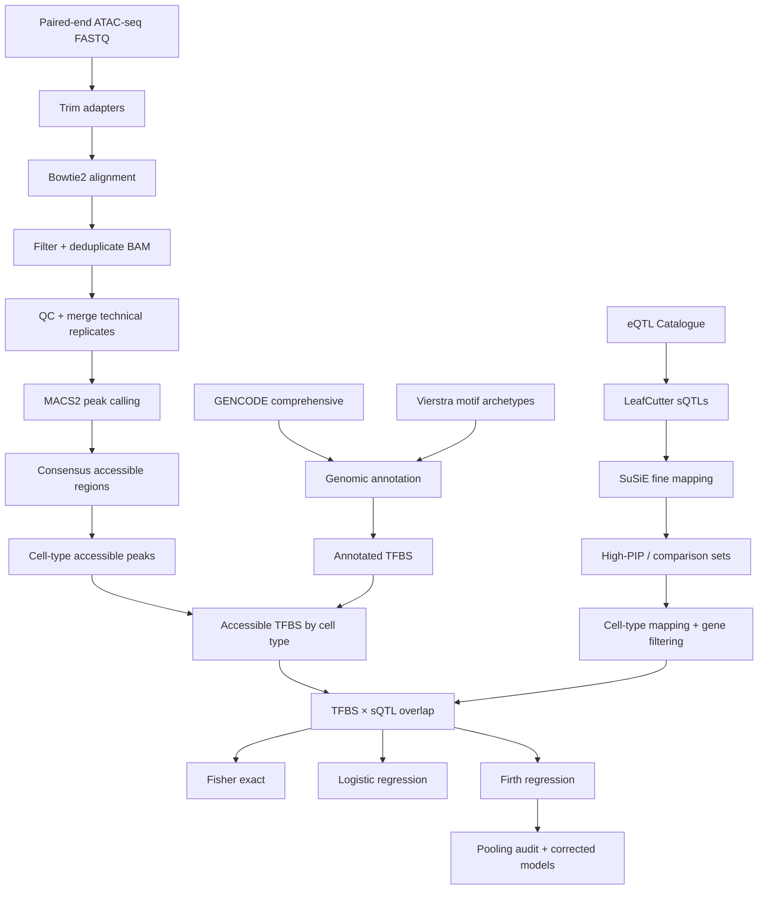
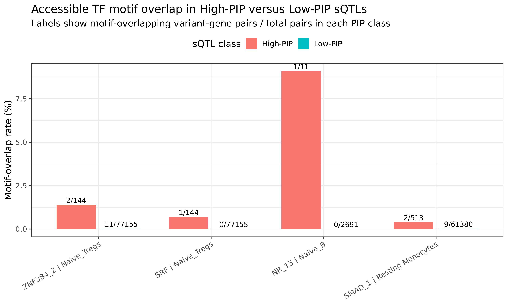

# Chromatin-accessible TFBS enrichment for fine-mapped immune-cell sQTLs

Integrative computational genomics analysis testing whether **high-confidence, fine-mapped splicing QTLs preferentially intersect transcription-factor binding sites that are chromatin-accessible in the relevant human immune-cell context**.

Splicing QTLs can identify genetic variants associated with changes in RNA splicing, but fine-mapping alone does not explain the regulatory context in which those variants may act. This project combines **immune-cell ATAC-seq**, **transcription-factor motif annotations**, and **LeafCutter/SuSiE fine-mapped sQTLs** to investigate whether candidate splice-regulatory variants localize to accessible regulatory elements in specific immune-cell types.

> **Biological question:** Are high-confidence sQTL variants enriched within intragenic, chromatin-accessible TF binding sites in specific immune-cell contexts compared with lower-confidence variants?

> **Key finding:** After covariate adjustment, sparse-data-aware modeling, and source-aware pooling correction, a small number of motif–cell-type combinations showed significant enrichment, including ZNF384_2 and SRF in naïve regulatory T cells.

## What this project demonstrates

- End-to-end ATAC-seq processing on an HPC cluster: trimming, Bowtie2 alignment, filtering, deduplication, QC, MACS2 peak calling, consensus regions, fragment counts, and BigWig generation.
- Validation of reprocessed chromatin-accessibility results against published Calderon differential-accessibility estimates.
- hg19 → hg38 coordinate harmonization and GENCODE/Vierstra genomic annotation.
- Cell-type-specific TFBS accessibility profiling.
- Processing and integration of RNA-seq-derived LeafCutter/SuSiE sQTL results from the eQTL Catalogue.
- Fisher's exact tests, covariate-adjusted logistic regression, Firth penalized logistic regression, BH-FDR, VIF diagnostics, and sensitivity analysis.
- Dataset-pooling audit and source-preserving re-estimation of affected Firth models.
- R, Python, Bash, Linux, SLURM arrays, and manifest-driven HPC workflows.

## Workflow



## Representative results

### ATAC reprocessing validation

Reprocessed differential-accessibility log-fold changes showed strong concordance with matched published Calderon estimates (**Spearman = 0.807; Pearson = 0.88**).


### sQTL overlap with accessible TFBSs

High-confidence sQTLs showed increased overlap with accessible TFBSs for a small subset of motif × cell-type combinations, motivating covariate-adjusted modeling and sparse-data-aware regression.



### Sparse-data-aware modeling

The final source-aware Firth analysis covered **286 motif archetypes × 6 immune-cell contexts = 1,716 model combinations**. Only 503 combinations had sufficient motif variation for a Firth fit, illustrating why sparse-data diagnostics were essential.

Two final corrected associations passed global BH-FDR < 0.05: **ZNF384_2–Naive Tregs** and **SRF–Naive Tregs**. Because the overlap counts are sparse, the large odds ratios are treated as hypothesis-generating signals rather than stable biological effect-size estimates.


More detailed interpretation is in [`docs/RESULTS.md`](docs/RESULTS.md).

## Repository structure

```text
.
├── config/
├── scripts/
│   ├── 01_atac_seq/
│   ├── 02_atac_validation/
│   ├── 03_genomic_annotation/
│   ├── 04_tfbs_accessibility/
│   ├── 05_sqtl_integration/
│   ├── 06_statistics/
│   │   ├── logistic/
│   │   └── firth/
│   └── 07_dataset_pooling/
├── figures/
├── example_outputs/
├── docs/
└── environment.example.yml
```

## Technologies

**Languages / workflow:** R, Python, Bash, Linux, SLURM, HPC  
**Genomics:** ATAC-seq, Bowtie2, samtools, Picard, MACS2, featureCounts, bedtools, liftOver, GENCODE, GenomicRanges  
**QTL / splicing:** LeafCutter, SuSiE fine-mapping, eQTL Catalogue  
**Statistics:** Fisher's exact test, logistic regression, Firth logistic regression, BH-FDR, VIF diagnostics, limma-voom

## Data sources

- Calderon et al. (2019), *Landscape of stimulation-responsive chromatin across diverse human immune cells*, Nature Genetics.
- Kerimov et al. (2021), *A compendium of uniformly processed human gene expression and splicing quantitative trait loci*, Nature Genetics.
- Kerimov et al. (2023), *eQTL Catalogue 2023: New datasets, X chromosome QTLs, and improved detection and visualisation of transcript-level QTLs*, PLOS Genetics.
- GENCODE comprehensive annotations.
- Vierstra transcription-factor motif archetypes.

## Scope and data availability

The original O2 research workspace was approximately **2.6 TB** because it contained raw sequencing files, BAMs, peak calls, full QTL downloads, intermediate matrices, generated outputs, and SLURM logs. Those files are intentionally not redistributed here.

This repository contains workflow code, configuration templates, representative outputs, figures, and documentation for the analysis.

### RNA-seq scope

This project processed **RNA-seq-derived LeafCutter sQTL results** from the eQTL Catalogue. It does **not** claim that the underlying RNA-seq FASTQ alignment/quantification pipeline was rerun as part of this work.

## Reproducibility and provenance

The original workflows ran in Harvard Medical School's O2 HPC environment. Account-specific absolute O2 paths and identifiers are excluded from this repository. Configuration templates under `config/` show the expected inputs without exposing private paths.

See [`docs/METHODS.md`](docs/METHODS.md), [`docs/RESULTS.md`](docs/RESULTS.md), and [`docs/SOURCE_PROVENANCE.tsv`](docs/SOURCE_PROVENANCE.tsv).
