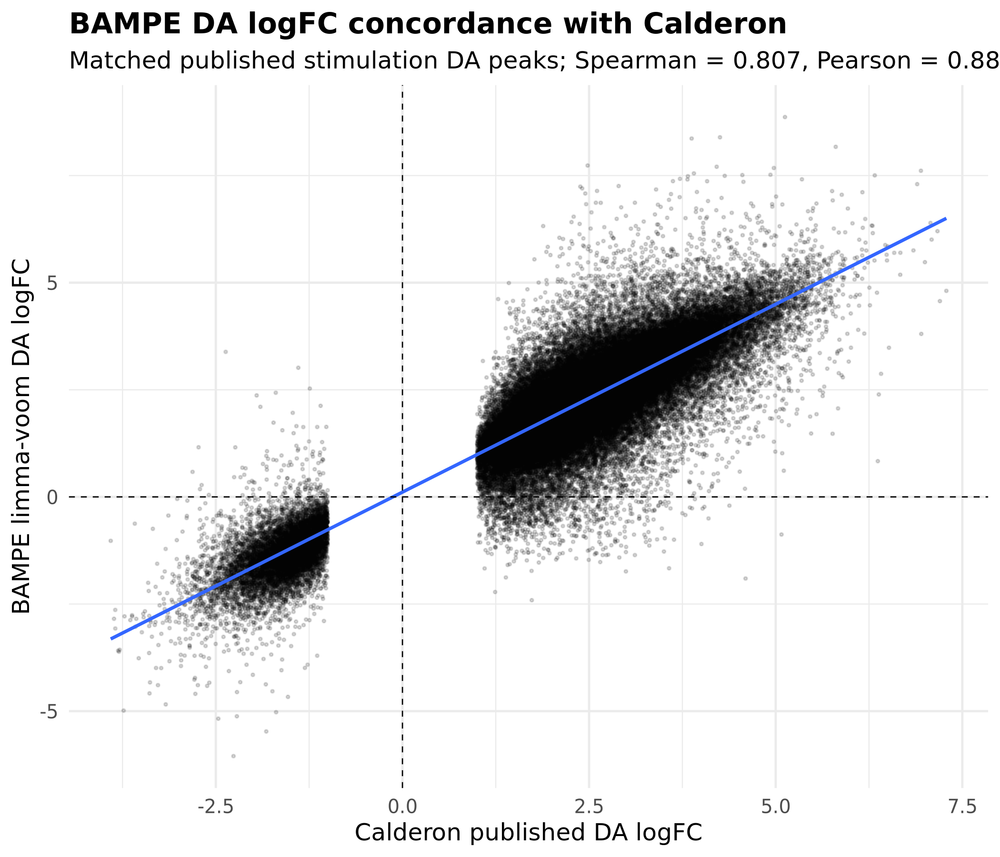
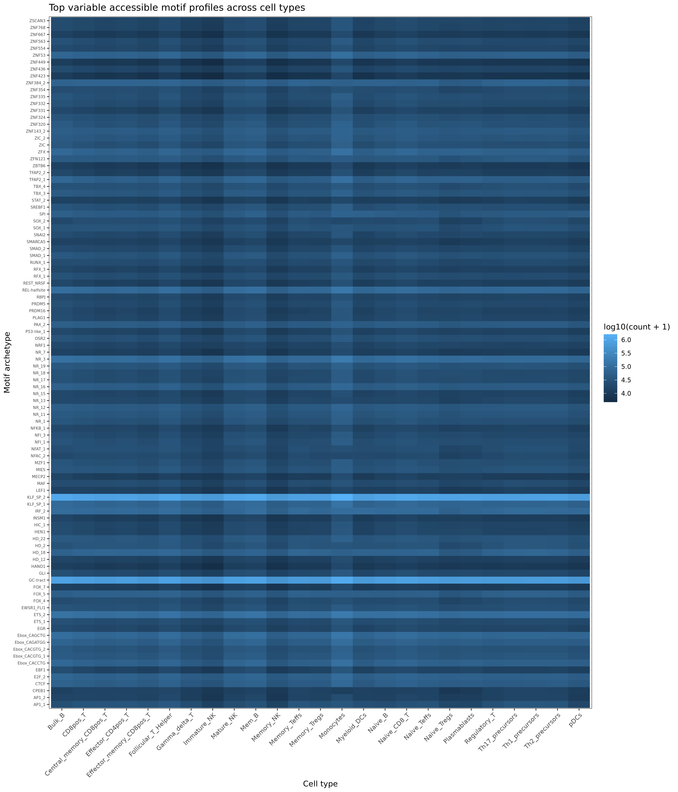
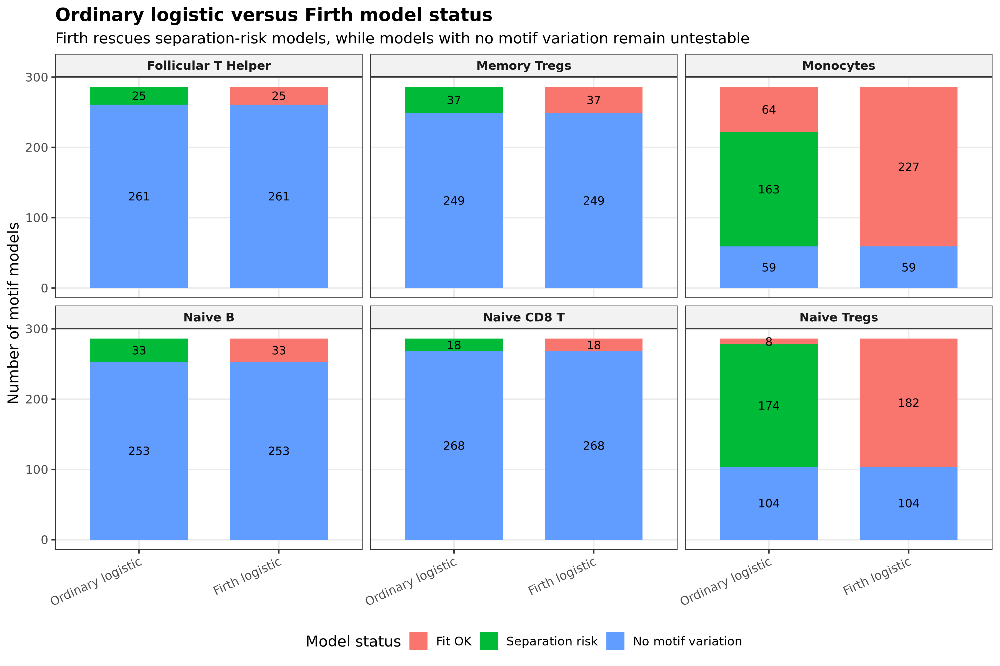
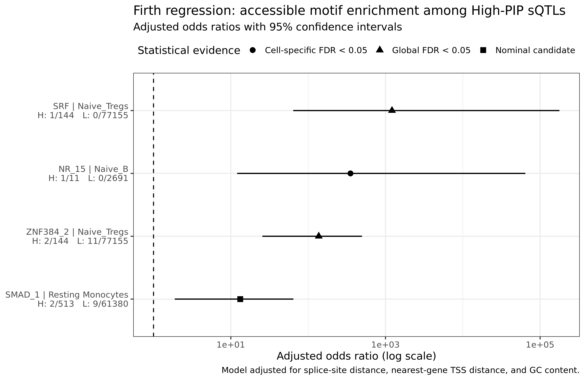
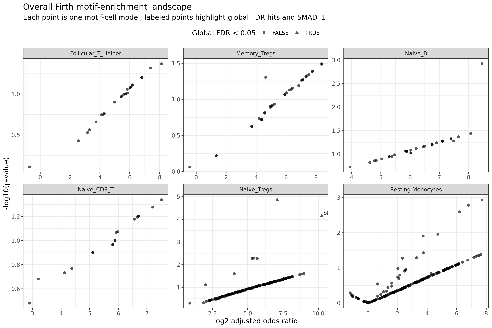
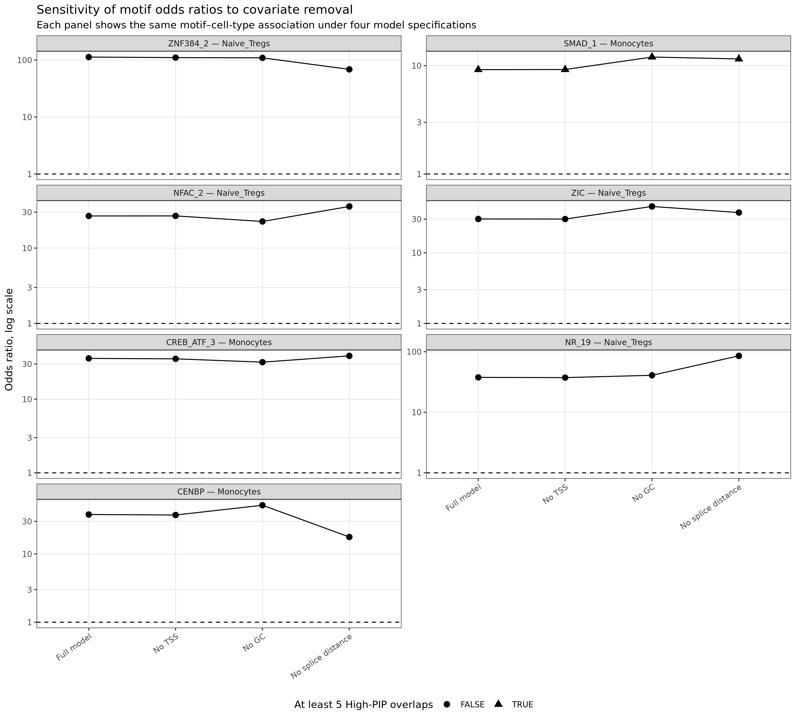

# Representative results and interpretation

## ATAC-seq validation

The reprocessed BAMPE differential-accessibility estimates showed strong concordance with matched published Calderon stimulation results (**Spearman = 0.807; Pearson = 0.88** in the selected validation figure).

## Cell-type-specific accessible TFBS profiles

Motif archetypes showed heterogeneous accessibility across immune-cell contexts, motivating cell-type-specific rather than purely global overlap tests.

## Why Firth regression was needed

The high-PIP class was much smaller than the low-PIP comparison class, and many motif × cell-type combinations had zero or very small overlap counts. Ordinary logistic regression therefore produced combinations with separation risk or non-estimable motif effects. Firth penalized logistic regression was used to stabilize inference in this sparse setting.

## Final corrected Firth analysis

The final source-aware analysis evaluated **1,716 motif × cell-type combinations** (286 motif archetypes across six immune-cell contexts). **503 combinations had motif variation sufficient for a Firth fit**.

Two associations passed **global BH-FDR < 0.05**:

| Motif | Cell type | High-PIP overlap | Low-PIP overlap | Adjusted OR | 95% CI | Global FDR |
|---|---|---:|---:|---:|---|---:|
| ZNF384_2 | Naive Tregs | 2 / 144 | 11 / 77,155 | 137.0 | 25.6–496.9 | 0.0070 |
| SRF | Naive Tregs | 1 / 144 | 0 / 77,155 | 1,214.2 | 64.2–177,863.4 | 0.0183 |

One additional association, **NR_15 in Naive B cells**, passed within-cell-type FDR (0.0396) but not global FDR.

### Interpretation caution

These candidate effects are based on sparse motif-overlap counts. The large odds-ratio estimates and wide confidence intervals are therefore treated as **hypothesis-generating enrichment signals**, not experimentally validated effect sizes. Sparse-data behavior is also why Firth regression, sensitivity analyses, and the later dataset-pooling audit were important.

## Covariate sensitivity

Primary models adjusted for splice-site distance, gene/TSS distance, and local GC content. Candidate estimates were also examined under covariate-removal sensitivity specifications.

